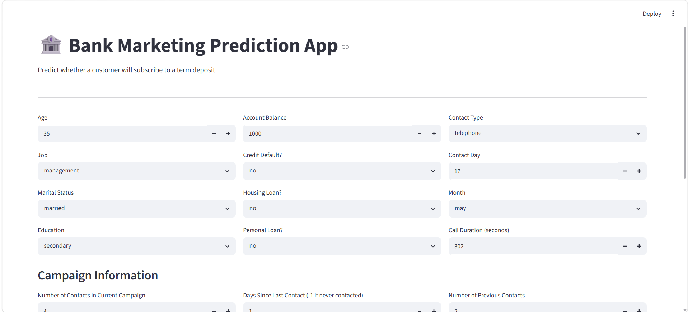
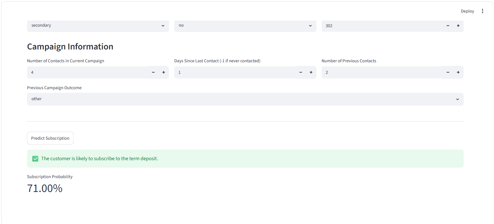

# 🏦 Bank Marketing Prediction

## 📌 Project Overview

This project predicts whether a customer is likely to subscribe to a banking marketing campaign using machine learning classification techniques.

The application helps identify potential customers who are more likely to respond positively to marketing efforts.

---

## 🎯 Problem Statement

Marketing campaigns can be expensive and time-consuming.

This project helps improve campaign efficiency by predicting customer subscription behavior before contacting customers.

---

## 📊 Model Performance

| Metric              | Value |
| ------------------- | ----: |
| Accuracy            | 85.8% |
| Precision (Class 1) |  0.83 |
| Recall (Class 1)    |  0.88 |
| F1 Score (Class 1)  |  0.86 |

---

## 🚀 Features

* Data preprocessing
* Feature encoding
* Classification modeling
* Customer subscription prediction
* Interactive Streamlit interface

---

## 🛠️ Technologies Used

* Python
* Pandas
* NumPy
* Scikit-Learn
* Streamlit

---

## 📷 Application Preview

---

## 📁 Project Structure

bank-marketing-predictor/

├── app.py

├── requirements.txt

├── bank_marketing.ipynb

├── README.md

├── home.png

└── prediction.png

---

## 💡 Future Improvements

* Compare additional classification models
* Advanced feature engineering
* Deploy the application online
* Add customer segmentation
